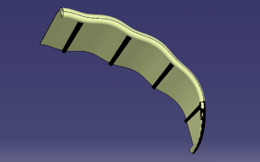
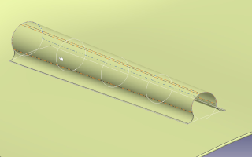
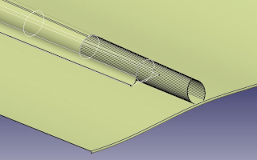
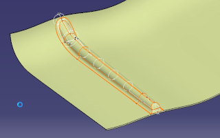

# Tutorial for creating LEI kite struts in CATIA

The tutorial explains how to create a strut of a leading-edge inflatable (LEI) kite in CATIA. The approach is valid for all struts, with some adjustments where necessary.

The process is divided into five steps, each covering a different part. Per step an explanatory video is provided and a resulting CAD file of the geometry. Video and CAD files are placed in separate directories per step. This is useful for checking your intermediate work if it does not work as intended. Based on the explanatory videos, it should be possible to at least understand the basic steps that are taken. It is by no means meant as an introduction to CATIA or covering every step along the way of the design. Based on the functions used in these videos, all other operations can be done as well. In case something is unclear, you can open the Final CAD file and have a look through there. In case a link is unclear, use the parents/children function to trace back the parent of the part/surface you are looking at. This way you can trace back every surface and find out how they were generated at to which parts they are linked.

## Step 1

Click the image to watch the video. Open the two `stp`-files in this folder in CATIA and perform the operations as explained in the video. `CADstep1.CATPart` is file after these operations are completed

## Step 2

This video shows how to do the mid section of a strut. `CADstep2.CATPart` is file after this step is completed.

## Step 3

This video shows how to do the front section of a strut. `CADstep3.CATPart` is file after this step is completed.

## Step 4

This video shows how to do the rear section of a strut. `CADstep4.CATPart` is the file after this step is completed.

## Step 5

This video shows how to join the front, mid and rear bits together for exporting. `CADstep5.CATPart` is the file after this step is completed.

## Publications

Viré, A., Lebesque, G., Folkersma, M., Schmehl, R.: Effect of Chordwise Struts and Misaligned Flow on the Aerodynamic Performance of a Leading-Edge Inflatable Wing. Energies, 15(4), 1450, 2022. https://doi.org/10.3390/en15041450

Lebesque, G.: Steady-state RANS simulation of a leading edge inflatable wing with chordwise struts. MSc Thesis, TU Delft, 2020. http://resolver.tudelft.nl/uuid:f0bc8a1e-088d-49c5-9b77-ebf9e31cf58b

Oehler, J., Schmehl, R.: Aerodynamic characterization of a soft kite by in situ flow measurement. Wind Energy Science, 4, pp. 1-21, 2019. http://doi.org/10.5194/wes-4-1-2019

## Authors

The tutorial was compiled by Geert Lebesque, as a follow up of his [MSc thesis](http://resolver.tudelft.nl/uuid:f0bc8a1e-088d-49c5-9b77-ebf9e31cf58b) at TU Delft. The material was arranged in repository format by Roland Schmehl.
